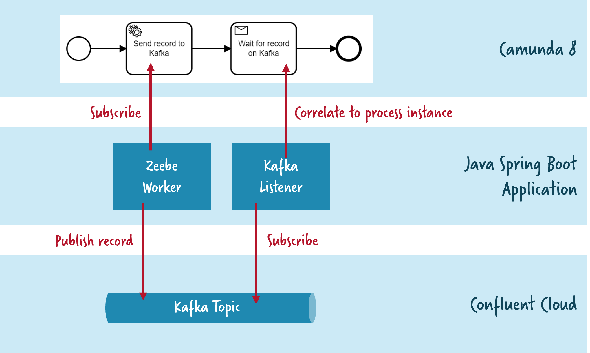

# Confluent Cloud (Apache Kafka) and Camunda Platform 8 (Zeebe) 

## Sample Glue Code Written in Java Spring Boot

Simple example code connecting Confluent Cloud (Kafka) and Camunda Platform 8 SaaS (Zeebe) by leveraging the Java Spring Boot integrations of both frameworks.

The example automates a very simple process, that

- writes a record to Kafka
- listens to the exact same record to correlate it back to the process instance



## How to run

* Create Kafka cluster in Confluent Cloud: https://confluent.cloud/
* Create client credentials and add them to ``application.properties``

* Create Camunda cluster in Camunda 8 Saas: https://console.cloud.camunda.io/
* Create client credentials and add them to ``application.properties``

* Start up Java application, which will
  * Deploy the process (visible via Camunda Operate)
  * Create the topics (visible via Confluent Console)
* Kick off a new process instance, e.g.
  * via Camunda Desktop Modeler

## How to create Camunda cluster locally

* https://docs.camunda.io/docs/self-managed/platform-deployment/helm-kubernetes/guides/local-kubernetes-cluster/

### Create a local kubernetes cluster
```
kind create cluster --name camunda-platform-local

# switch to the new cluster: camunda-platform-local

kubectl cluster-info --context kind-camunda-platform-local

# deploy via helm

helm repo add camunda https://helm.camunda.io
helm repo update

# install camunda Platform 8

helm install dev camunda/camunda-platform \
    -f camunda-platform-core-kind-values.yaml
```

### Gateway for clients
```
kubectl port-forward svc/dev-zeebe-gateway 26500:26500
```

### Accessing web applications
```
kubectl port-forward svc/dev-operate  8081:80
kubectl port-forward svc/dev-tasklist 8082:80
kubectl port-forward svc/dev-optimize 8083:80
```

Then, you can access each app pointing your browser at:

* Operate: http://localhost:8081
* Tasklist: http://localhost:8082
* Optimize: http://localhost:8083
* 
Log in to these services using the demo/demo credentials.

### Clean

```
kind delete cluster --name camunda-platform-local
```

## Glossary
* SASL: Simple Authentication and Security Layer
* JAAS: Java Authentication and Authorization Service
* SSL: Secure Socket Layer
